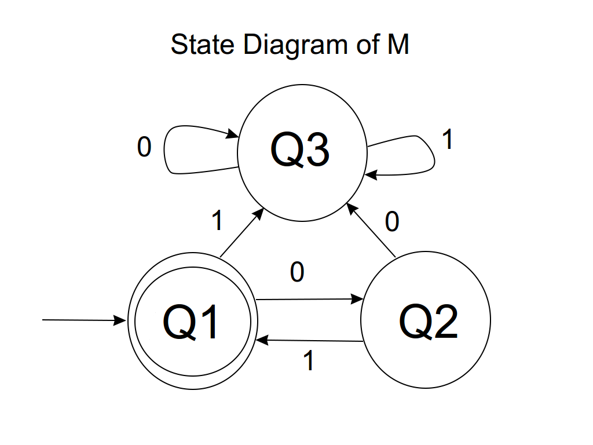

## Walkthrough

Our example machine `M` can be defined formally as (`Q`, `Σ`, `δ`, `q0`, `F`), where
- `Q` = {`Q1`, `Q2`, `Q3`}
- `Σ` = {`0`, `1`}
- `δ` is fully described by the equations
  - `δ(Q1, 0) = Q2`
  - `δ(Q1, 1) = Q3`
  - `δ(Q2, 0) = Q3`
  - `δ(Q2, 1) = Q1`
  - `δ(Q3, 0) = Q3`
  - `δ(Q3, 1) = Q3`
- `q0` = `Q1`
- `F` = {`Q1`}

The mathematical definition is translated into Haskell in `Example.hs`.

The machine `M` recognizes the language `L(M)` = `{(01)^n | n is a nonnegative integer }`. That is to say that `M` accepts an input string `w` if and only if `w` is a member of `L(M)`. This is verified by the test cases given in `Spec.hs`.

 A state diagram is provided below to help one visualize `M`.

 